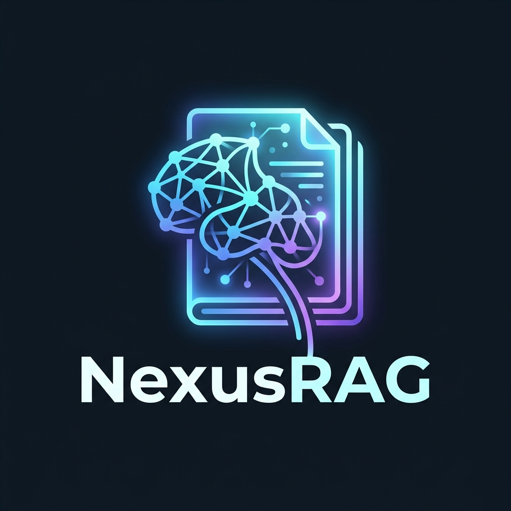

# NexusRAG - Intelligent Academic Assistant



**NexusRAG** is a powerful, agentic AI research assistant designed to automate academic research, indexing, and synthesis. Built with Streamlit and powered by Gemini, it transforms dense academic papers into structured, actionable insights.

## Features

- **Agentic Pipeline**: Automates subtopic generation, fetching, indexing, and synthesis.
- **Smart Indexing**: Utilizes FAISS and heuristic-based text extraction to ignore "PDF noise" and focus on technical content.
- **Dynamic Retrieval**: Cross-references academic papers to highlight contradictions, research gaps, and methodologies.
- **Interactive Mentor**: Chat directly with the synthesized report to ask follow-up questions.
- **Paper Review Mode**: Upload your own research draft and receive an automated structural critique.

## Tech Stack

- **Frontend**: Streamlit
- **AI/LLM**: Google Gemini (`google-generativeai`)
- **Vector Store**: FAISS (`faiss-cpu`)
- **Embeddings**: Sentence Transformers
- **PDF Extraction**: PDFPlumber
- **Backend/Logic**: Pure Python

## Project Structure

```
NexusRAG/
├── src/                    # Backend modules and logic
│   ├── agent.py            # Main Agentic RAG pipeline orchestration
│   ├── llm.py              # Gemini integration and prompt logic
│   ├── fetch.py            # ArXiv and Semantic Scholar API clients
│   ├── database.py         # FAISS Vector Store logic
│   ├── pdf_reader.py       # PDF parsing and heuristic extraction
│   └── pdf_generator.py    # Report PDF generation
├── app.py                  # Main Streamlit Dashboard entry point
├── main.py                 # CLI interface
├── mcp_server.py           # FastMCP integration server
├── requirements.txt        # Dependencies
├── .env.example            # Environment variables template
└── README.md               # Documentation
```

## Setup & Installation

### 1. Clone the repository
```bash
git clone https://github.com/yourusername/NexusRAG.git
cd NexusRAG
```

### 2. Create a Virtual Environment
```bash
python -m venv venv
# On macOS/Linux:
source venv/bin/activate
# On Windows:
venv\Scripts\activate
```

### 3. Install Dependencies
```bash
pip install -r requirements.txt
```

### 4. Environment Variables
Create a `.env` file in the root directory (you can use `.env.example` as a template) and add your API keys:
```env
GEMINI_API_KEY="your_api_key_here"
SEMANTIC_SCHOLAR_API_KEY="your_api_key_here" # Optional but recommended
```

### 5. Run the Application
Launch the Streamlit dashboard:
```bash
streamlit run app.py
```

### Deployment (Streamlit Community Cloud)
When deploying to Streamlit Community Cloud:
1. Connect your GitHub repository.
2. Set the main file path to `app.py`.
3. Add your `GEMINI_API_KEY` and `SEMANTIC_SCHOLAR_API_KEY` in the Advanced Settings -> Secrets section.
4. **Note**: Streamlit Community Cloud has a 1GB memory limit. Be mindful when running heavy embedding models.

## Usage

1. Open the application in your browser.
2. Select **Research Agent** or **Paper Review** from the sidebar.
3. **Research Agent**: Enter a topic (e.g., "Multi-Agent Reinforcement Learning"), configure the search settings, and click Generate Report.
4. **Paper Review**: Upload a PDF of your manuscript and click Run Structural Analysis for instant feedback.

## License

MIT License. See `LICENSE` for more details.
